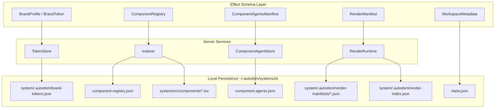

# Design System Persistence Schema Plan

## Goal

Ensure every design token and every created/rendered component has a **validated, durable, recoverable schema** — from Effect contracts through on-disk JSON to publish/export metadata — so AutoDSM can list, edit, preview, diff, and ship design systems without data loss after restarts.

## Scope boundary (non-negotiable)

AutoDSM v1 is **local-first**. Supabase holds identity, beta gate, telemetry, feedback, and anonymized publish stats only. **Design tokens, component source, registries, render state, and conversations never go to Postgres.**

| Layer | Role | Stores tokens/components? |
| ----- | ---- | ------------------------- |
| **Effect Schema** (`packages/contracts/src/autodsmArtifacts.ts`) | Canonical typed contracts for RPC + disk | Defines shape |
| **Local JSON** (`~/.autodsm/systems/<id>/`) | v1 durable store | **Yes — primary DB** |
| **T3 Code SQLite** (`apps/server/src/persistence/`) | Orchestration threads/sessions | Links only (`projectId`, `threadId`) |
| **Supabase Postgres** (`supabase/migrations/`) | Auth + ops telemetry | **No** |

This plan fixes **local persistence + contract alignment**, not cloud replication.

---

## Current state (audit)

### What works today

| Artifact | Disk path | Schema owner | Survives restart |
| -------- | --------- | ------------ | ---------------- |
| `BrandProfile` tokens | `system/.autodsm/brand-tokens.json` | `autoDsmTokenStore.ts` | Yes |
| Component source | `system/src/components/*.tsx` | workspace git tree | Yes |
| `ComponentAgentsManifest` | `component-agents.json` (workspace root) | `componentAgentStore.ts` | Yes |
| `ComponentConversation` | `conversations/<slug>.json` | `conversationStore.ts` | Yes |
| `Session` / `ChangeSet` | `sessions/<id>/…` | `sessionStore.ts`, `changeSetStore.ts` | Yes |
| Render manifests (write) | `system/.autodsm/render-manifests/<id>.json` | `AutoDsmWorkspaceService.ts` | Written, **not read back** |

### Known gaps

1. **Doc vs code path mismatch** — docs/skills say `system/tokens.json`; code uses `system/.autodsm/brand-tokens.json`.
2. **`ComponentRegistry` is ephemeral** — rebuilt on every `getComponentRegistry` RPC; no persisted index or invalidation cache.
3. **Dual component models undocumented** — sidebar/AI uses `component-agents.json`; preview/props uses volatile registry scan.
4. **`getRenderManifest` is memory-only** — disk JSON ignored after server restart (`AutoDsmWorkspaceService.ts` ~856).
5. **Publish token count bug** — `publishedExportStore.ts` reads `system/tokens.json` (wrong path → count 0).
6. **`WorkspaceMetadata.storybookPort`** — in contract, never written to `meta.json`.
7. **No schema migration runner** for local JSON version bumps (`schemaVersion` fields exist but no unified migrator).
8. **Scan artifacts** — in-memory only; not required for v1 but blocks “render health history.”

---

## Target architecture



### Canonical on-disk layout (target)

```txt
~/.autodsm/systems/<id>/
  meta.json                              # WorkspaceMetadata (incl. indexer + render ports)
  component-agents.json                  # ComponentAgentsManifest
  component-registry.json                # NEW: persisted ComponentRegistry snapshot
  conversations/<slug>.json
  sessions/<session-id>/…
  system/
    src/components/*.tsx                 # component source (source of truth for code)
    .autodsm/
      brand-tokens.json                    # BrandProfile token array (canonical)
      brand-profile.meta.json              # NEW: invalidationKey, lastSyncedAt, cssPaths
      render-index.json                    # NEW: manifestId → componentId, status, renderedAt
      render-manifests/<manifestId>.json
      design-brief.md / design-brief.json
```

---

## Phase 1 — Schema contract alignment

**Objective:** Single source of truth for artifact paths, versions, and validation.

### Tasks

1. **Add `autodsmPersistencePaths.ts`** in `apps/server/src/autodsm/` exporting canonical relative paths used by all stores (no duplicated string literals).
2. **Update docs** — `skills/architecture/artifact-contracts.md`, `AUTODSM.md`, `docs/autodsm-target-state/README.md` to match `brand-tokens.json` and `component-agents.json`.
3. **Extend `AutoDsmArtifactMeta`** usage — every read/write path validates `schemaVersion` and rejects unknown versions with actionable errors.
4. **Add `AutoDsmPersistenceManifest` schema** (optional v1) — one file listing artifact paths + schema versions for workspace recovery tooling.

### Acceptance

- Grep for `tokens.json` in server code returns zero writers (only migration shim if needed).
- All store modules import paths from `autodsmPersistencePaths.ts`.
- Contract tests decode sample fixtures for each artifact type.

### Files

- `packages/contracts/src/autodsmArtifacts.ts`
- `apps/server/src/autodsm/autodsmPersistencePaths.ts` (new)
- `skills/architecture/artifact-contracts.md`

---

## Phase 2 — Design token schema hardening

**Objective:** Tokens are always valid, versioned, and reflected in derived CSS/theme outputs.

### Tasks

1. **Confirm `AutoDsmBrandToken` categories** cover colors, typography, spacing, radius, motion, shadows — extend schema if UI tables need fields not yet modeled.
2. **Split profile envelope** — keep `brand-tokens.json` as `{ schemaVersion, tokens[] }`; add `brand-profile.meta.json` for `invalidationKey`, `cssVariablePaths[]`, `lastResyncAt`, `origin` summary (matches `AutoDsmBrandProfile` without duplicating token array).
3. **Implement `readBrandProfile` / `writeBrandProfile` validation** — decode through Effect Schema on every load; auto-migrate v1→v2 in one place (`autoDsmTokenStore.ts`).
4. **Fix publish pipeline** — `publishedExportStore.ts` reads token count from `brand-tokens.json` via shared path helper.
5. **Token ↔ component usage index** (Phase 6 roadmap) — new optional artifact `token-usage.json`: `{ tokenId, componentIds[] }` rebuilt by scanner; schema in contracts.

### Acceptance

- Token CRUD round-trips through schema decode/encode tests.
- Export manifest `tokenCount` matches live token store.
- `brandTokenThemeSync` runs only when `invalidationKey` changes.
- Corrupt JSON surfaces RPC error with file path, not silent empty state.

### Files

- `apps/server/src/autodsm/autoDsmTokenStore.ts`
- `apps/server/src/autodsm/brandTokenThemeSync.ts`
- `apps/server/src/autodsm/publishedExportStore.ts`
- `apps/server/src/autodsm/autoDsmTokenStore.test.ts`

---

## Phase 3 — Component registry persistence

**Objective:** Every created component is indexed, queryable, and linked to agents + render state without full rescan on every RPC.

### Tasks

1. **Persist `ComponentRegistry`** to `component-registry.json` at workspace root:
   ```json
   {
     "schemaVersion": 1,
     "meta": { "kind": "component-registry", … },
     "entries": [ … ],
     "status": "ready" | "stale" | "failed",
     "indexedAt": "…",
     "sourceFingerprint": "hash(src/components/**)"
   }
   ```
2. **Indexer invalidation** — recompute when:
   - `src/components/` mtime fingerprint changes
   - workspace build gate result changes
   - manual `autodsm.resyncComponentRegistry` RPC
3. **Reconcile with `component-agents.json`** — keep `reconcileComponentIdsFromRegistry()`; run after every index write.
4. **Registry entry schema** must include:
   - `componentId`, `relativePath`, `exports[]`, `propsByExport`, `ComponentPreviewManifest`
   - `renderStatus`: `never` | `ok` | `error` | `stale` (from latest manifest)
   - `lastRenderedAt` (denormalized from render index)
5. **Document split** in `artifact-contracts.md`:
   - **Agents manifest** = navigation + AI thread binding
   - **Registry** = props/exports/preview/render health

### Acceptance

- Cold server start: `getComponentRegistry` returns persisted snapshot without scanning (unless stale).
- New component file → status `stale` until indexer runs → `ready` with entry.
- Sidebar and component page show same `componentId` for a given TSX file.

### Files

- `apps/server/src/autodsm/AutoDsmWorkspaceService.ts` (`getComponentRegistry`)
- `apps/server/src/autodsm/componentRegistryStore.ts` (new)
- `apps/server/src/componentPreview/analyzeReactComponent.ts`
- `apps/server/src/autodsm/componentAgentStore.ts`

---

## Phase 4 — Render state persistence

**Objective:** Every rendered component leaves a recoverable manifest + index entry.

### Tasks

1. **Fix `getRenderManifest`** — read from `system/.autodsm/render-manifests/<id>.json` on cache miss; populate in-memory cache.
2. **Add `render-index.json`**:
   ```json
   {
     "schemaVersion": 1,
     "entries": {
       "<componentId>": {
         "latestManifestId": "…",
         "status": "ok" | "error",
         "renderedAt": "…",
         "exportName": "…"
       }
     }
   }
   ```
3. **Update `executeRenderPlan`** — after writing manifest JSON, upsert render-index + patch registry entry `renderStatus` / `lastRenderedAt`.
4. **Wire `ComponentAgentRecord.lastRenderedAt`** from render-index on agent list (single source).
5. **Schema: `AutoDsmRenderManifest`** — ensure persisted JSON includes `componentId`, `entryId`, `diagnostics[]`, `timings`, `bundledJavascript` hash (not full bundle on disk if too large — store hash + sidecar path).

### Acceptance

- Restart server → `getRenderManifest(manifestId)` returns last render result.
- Home dashboard can count “rendered vs failed” components from render-index.
- Component page shows last render error after restart without re-running render.

### Files

- `apps/server/src/autodsm/AutoDsmWorkspaceService.ts`
- `apps/server/src/autodsm/renderManifestStore.ts` (new)
- `packages/contracts/src/autodsmArtifacts.ts` (`AutoDsmRenderManifest`)

---

## Phase 5 — Workspace metadata & cross-artifact integrity

**Objective:** `meta.json` tracks indexer/render subsystem state; recovery tooling detects inconsistency.

### Tasks

1. **Extend `meta.json` schema** (`AutoDsmWorkspaceMetadata`):
   - `storybookPort` or `previewPort` (Vite sidecar port until Storybook lands)
   - `indexerStatus`, `lastIndexedAt`
   - `registryFingerprint`, `tokenInvalidationKey`
2. **Startup integrity check** (workspace open):
   - agents without registry entries → flag `orphaned`
   - registry entries without source file → flag `missing-source`
   - tokens file missing → seed from CSS
   - render-index pointing to missing manifest → prune entry
3. **RPC: `autodsm.validateWorkspaceArtifacts`** — returns structured report (no auto-fix in v1; optional repair in v1.1).
4. **Activity log events** — `registry.indexed`, `tokens.resynced`, `component.rendered` already partially exist; ensure all mutate paths append.

### Acceptance

- Opening a workspace runs integrity check once; UI can show warnings.
- `meta.json` reflects live preview port and index timestamps.

### Files

- `apps/server/src/autodsm/autodsmCreateWorkspace.ts`
- `apps/server/src/autodsm/workspaceIntegrity.ts` (new)
- `packages/contracts/src/rpc.ts` (new validate RPC)

---

## Phase 6 — Local schema migration framework

**Objective:** Safe upgrades when `schemaVersion` increments.

### Tasks

1. **`autodsmArtifactMigrator.ts`** — per-artifact migrators: `(raw, fromVersion) → decodedLatest`.
2. **Migration table in `meta.json`**: `{ "brand-tokens": 2, "component-registry": 1, … }`.
3. **Tests** — golden fixtures for v1 JSON → v2 JSON round trips.
4. **One-time shim** — if `system/tokens.json` exists and `brand-tokens.json` does not, migrate on first read (then delete legacy file).

### Acceptance

- Bump `schemaVersion` in contracts → migrator tests required before merge.
- Legacy workspaces open without manual file edits.

---

## Phase 7 — Supabase: what stays out, what gets richer

**Do not add** `design_tokens`, `components`, or `component_renders` tables to Supabase in v1.

Optional **privacy-preserving** extensions (already partially present):

| Table | Enhancement | Purpose |
| ----- | ----------- | ------- |
| `publish_stats` | Ensure `token_count` / `component_count` fed from fixed local export pipeline | Accurate aggregate metrics |
| `telemetry_events` | Event names only: `registry.indexed`, `component.rendered` (counts in properties, no paths) | Ops visibility |

Add migration **only** if product explicitly promotes hosted sync (v1.1+).

---

## Verification matrix

| Scenario | Expected persistence |
| -------- | -------------------- |
| Create workspace | `meta.json`, `component-agents.json`, seeded `brand-tokens.json`, empty `component-registry.json` |
| Add token via UI | `brand-tokens.json` updated, CSS/theme synced, `invalidationKey` changes |
| Create component (AI) | TSX on disk, agent record, registry entry after index, conversation JSON |
| Render component | manifest JSON + render-index entry + agent `lastRenderedAt` |
| Kill server, restart | registry + tokens + manifests readable without rescan/re-render |
| Publish package | export manifest token/component counts match local stores |
| Sign out / auth | Supabase session cleared; **local workspace artifacts untouched** |

### Automated tests to add

```bash
# Token + registry stores
bun run test -- apps/server/src/autodsm/autoDsmTokenStore.test.ts
bun run test -- apps/server/src/autodsm/componentRegistryStore.test.ts  # new
bun run test -- apps/server/src/autodsm/renderManifestStore.test.ts     # new
bun run test -- apps/server/src/autodsm/workspaceIntegrity.test.ts    # new

# Contract decode fixtures
bun run test -- packages/contracts/src/autodsmArtifacts.persistence.test.ts  # new
```

---

## Execution order & roadmap mapping

| This plan phase | Roadmap phase | Priority |
| --------------- | ------------- | -------- |
| Phase 1 — Contract alignment | Pre-6 | **P0** — unblocks all storage work |
| Phase 2 — Token hardening | Phase 6 | **P0** |
| Phase 3 — Registry persistence | Phase 4 + 7 | **P0** — sidebar + component page depend on it |
| Phase 4 — Render persistence | Phase 3 + 8 | **P0** — “rendered” is currently lossy |
| Phase 5 — Integrity | Phase 11 | P1 |
| Phase 6 — Migrations | Phase 11 | P1 |
| Phase 7 — Supabase scope | Phase 1 (done) | P2 — fix publish_stats inputs only |

Recommended PR sequence (small, reviewable):

1. `fix/autodsm-token-paths-and-publish-count` — Phase 1 paths + Phase 2 publish fix
2. `feat/autodsm-component-registry-store` — Phase 3
3. `feat/autodsm-render-manifest-hydrate` — Phase 4
4. `feat/autodsm-workspace-integrity` — Phase 5 + 6
5. `docs/autodsm-persistence-contracts` — Phase 1 doc alignment

---

## Out of scope (v1)

- Postgres tables for tokens/components
- Remote GitHub sync of registry
- Storybook-specific story files as persisted artifacts (until Storybook orchestrator lands; then add `stories/` index to registry entries)
- Hosted `PublishedSnapshot` brand book

---

## Success criteria

1. Every token mutation is schema-validated and on disk before RPC success.
2. Every component in the sidebar has a registry entry with props/exports/manifest.
3. Every successful render is retrievable after process restart.
4. Docs, contracts, and disk paths agree on filenames and locations.
5. Publish/export stats reflect real local token and component counts.
