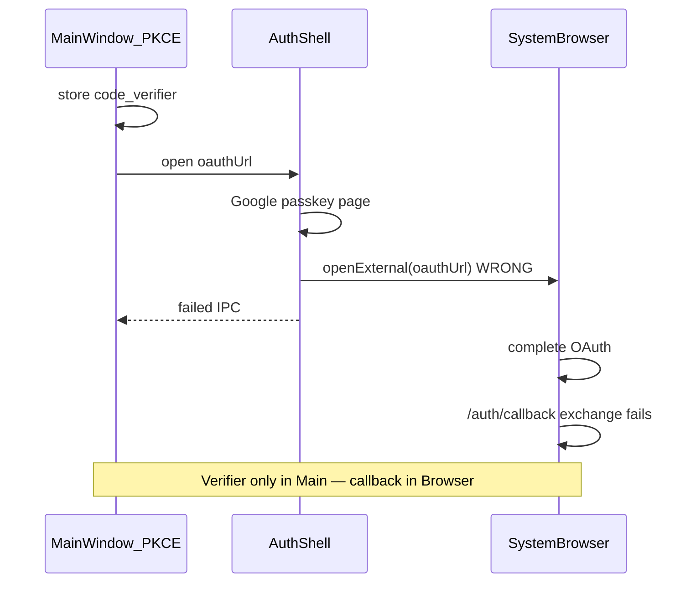

# Electron OAuth PKCE Fix — Diagnosis & Resolution Plan

> **Status (2026-06-02): RESOLVED in code.** All three phases shipped:
> Phase 1 — `supabaseOAuthWindow.ts` no longer calls `shell.openExternal`, keeps the
> auth shell open on passkey pages, retries `GOOGLE_PASSKEY_BYPASS_SCRIPT` on an
> interval, and injects the "Try another way" hint banner; `isGooglePasskeyChallengeUrl`
> matches passkey-only patterns (`passkey`, `webauthn`, `challenge/pk`, `challenge/skotp`)
> instead of generic `/challenge/`. Phase 2 — `oauthCallbackServer.ts` exists. Phase 3 —
> `autodsmAuthProtocol.ts` registers the `autodsm://` callback scheme. 38 oauth unit tests
> pass (`apps/desktop/src/oauth/`, `apps/web/.../auth.oauth.test.ts`). Remaining: the
> *interactive* sign-in smoke (GitHub + Google password/passkey) on the signed DMG — tracked
> with the hero-path smoke, needs a human.
>
> **Update (2026-06-02): system browser is now the DEFAULT.** `runSupabaseOAuthInSystemBrowser`
> (`supabaseOAuthBrowser.ts`) now opens the IdP in the user's **default browser** via the
> loopback callback server (`127.0.0.1:53682`) by default; the in-app auth shell is an opt-in
> fallback via `AUTODSM_OAUTH_SHELL=1`. This is PKCE-safe — the browser only returns the
> `?code=` (captured by the loopback server) and the main window still runs
> `exchangeCodeForSession` with its verifier. Side benefit: Google **passkey** accounts now
> work, since the system browser supports WebAuthn (the sandboxed shell could not). No OAuth
> details changed — same `oauthUrl`, redirect (`…:53682/auth/callback`, already in
> `supabase/config.toml`), provider, scopes, and PKCE flow.

## What you're seeing

| Screen | Message | Meaning |
|--------|---------|---------|
| Welcome | "Google passkey sign-in opened in your browser…" | Auth shell detected passkey, called `shell.openExternal(oauthUrl)`, and **aborted** the in-app flow |
| `/auth/callback` | "Sign-in did not complete. Try again from the welcome screen." | Callback ran in **system browser** (or stale route) without the Electron PKCE verifier → `exchangeCodeForSession` fails or profile is empty |

## Root cause (exact)

AutoDSM uses **Supabase PKCE** in the **main Electron window**:

1. `createSupabaseOAuthSignInUrl()` runs in the main renderer → stores `code_verifier` in **main window localStorage**
2. Auth shell opens IdP in an **isolated partition** (`persist:autodsm-oauth`)
3. On success, shell intercepts loopback redirect and returns `?code=` via IPC
4. Main window calls `exchangeCodeForSession(code)` using **its** verifier → session created

The passkey fallback **breaks step 4**:

```typescript
// supabaseOAuthWindow.ts (current broken path)
shell.openExternal(input.oauthUrl);  // NEW OAuth attempt in Chrome/Safari
finish({ ok: false, message: "…Complete sign-in there…" });
```

- External browser starts a **separate** OAuth/PKCE context (or completes without Electron's verifier)
- Redirect hits `http://127.0.0.1:<port>/auth/callback` in **Chrome**, not Electron
- Browser page calls `exchangeCodeForSession` with **browser localStorage** (no verifier) → failure
- User returns to AutoDSM; main window still has no session → welcome error or callback error

**WebAuthn/passkeys cannot run reliably in Electron's sandboxed auth shell** — but sending users to the system browser without a callback bridge is worse than staying in-shell.



## Fix strategy (phased)

### Phase 1 — Stop the bleeding (immediate)

**Goal:** Never open system browser for OAuth; keep PKCE single-context.

1. **Remove** `shell.openExternal` passkey fallback from `supabaseOAuthWindow.ts`
2. **Tighten** `isGooglePasskeyChallengeUrl()` — match passkey-only paths (`challenge/pk`, `passkey`, `webauthn`), not all `/v3/signin/challenge`
3. **Improve in-shell bypass** — retry `GOOGLE_PASSKEY_BYPASS_SCRIPT` on interval until user leaves passkey page or cancels
4. **Keep shell open** on passkey — do not call `finish(failed)` while bypass is in progress
5. **In-shell UX** — optional injected banner: "Passkeys aren't supported here — use **Try another way** → password"

**Acceptance:** Google sign-in completes in auth shell via password after "Try another way"; no welcome error about browser; no `/auth/callback` error in external browser.

### Phase 2 — PKCE-safe system browser (optional, if passkey-only accounts)

Only if Phase 1 is insufficient for accounts that **require** passkey with no password fallback.

1. **Dedicated callback port** — e.g. `http://127.0.0.1:53682/auth/callback` (add to Supabase redirect URLs)
2. **`oauthCallbackServer.ts` in main process** — one-shot HTTP server captures `?code=` / `?error=`
3. **Desktop-only redirect** — `supabaseAuthRedirectUrl()` returns dedicated URL when `isElectron`
4. **Flow:** main stores verifier → `openExternal(oauthUrl)` → main server captures code → IPC returns code → main exchanges

**Never** open external browser without the callback server running first.

### Phase 3 — Custom protocol (production hardening)

Register `autodsm://auth/callback?code=` (macOS URL scheme + Supabase allowlist). Same as Phase 2 but no port conflict with Vite dev server.

## Files

| Phase | Files |
|-------|-------|
| 1 | `apps/desktop/src/oauth/supabaseOAuthWindow.ts`, `supabaseOAuthUrl.ts`, tests |
| 2 | `apps/desktop/src/oauth/oauthCallbackServer.ts`, `auth.ts`, `electronOAuthSignIn.ts`, `supabase/README.md` |
| 3 | `apps/desktop/src/app/DesktopLifecycle.ts`, Electron protocol registration |

## Verification

### Automated

```bash
cd apps/desktop && bun run test -- src/oauth/
cd apps/web && bun run test -- src/lib/supabase/auth.oauth.test.ts
```

### Manual (Electron)

1. **GitHub** — shell → callback → `/onboarding/create` (no loop)
2. **Google (password account)** — account picker → completes in shell
3. **Google (passkey account)** — passkey page → auto or manual "Try another way" → password → completes in shell
4. **No external browser** opens during steps 1–3
5. Relaunch → session restores

## Out of scope

- Supabase-hosted passkey auth (use GitHub or password Google)
- Loading `/auth/callback` React route inside auth shell (shell intercepts code only)
